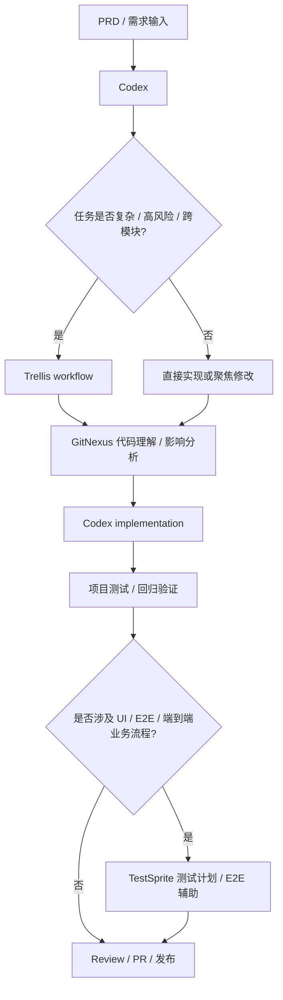

# AI Tools 项目工具流程精简概要

> 本文件记录个人 Codex Agent Harness 的模板化工具定位、版本监控基线和 Skill 编排规则。
> 当前主流程已收敛为 `Codex + GitNexus + Trellis + TestSprite`。
> agentmemory 已从流程中移除；Graphify 降级为用户主动调用且确认安装后才使用的可选架构可视化工具。

## 0. 版本监控配置

> 自动化任务优先读取本章节。后续如需新增指定工具，在下表继续追加即可。

| 工具 | GitHub 仓库 | 当前使用版本 | 版本通道策略 | 是否启用监控 | 备注 |
|---|---|---:|---|---|---|
| Codex | openai/codex | v0.135.0 | stable-only | 是 | 核心 Coding Agent |
| Trellis | mindfold-ai/trellis | v0.6.0-beta.21 | same-prerelease-channel | 是 | 复杂任务编排 / TDD workflow |
| GitNexus | abhigyanpatwari/GitNexus | V1.6.5 | stable-only | 是 | 代码理解、依赖关系、影响分析 |
| Graphify | safishamsi/graphify | v0.8.22 | stable-only | 是 | 可选架构可视化；仅用户主动调用且确认安装时使用 |
| TestSprite | 待明确 | latest | manual | 否 | 测试计划、E2E、自动化测试辅助 |
| 待添加 | owner/repo | 未明确 | stable-only | 否 | 后续需要监控的新工具在此补充 |

---

## 1. 当前核心 Agent Harness Workflow

### 1.1 主流程



Graphify 不进入默认链路。只有用户明确提到 Graphify、`$graphify`、知识图谱或图谱可视化，并确认当前环境已安装 Graphify 且命令可执行时，才使用 Graphify。

### 1.2 工具定位

| 工具 | 当前定位 | 是否进入主流程 | 使用边界 |
|---|---|---:|---|
| Codex | 主 coding agent | 是 | 默认执行代码理解、修改、调试、测试、文档生成等任务 |
| GitNexus | 代码理解 / 影响分析 / debug / refactor 辅助 | 是 | 代码结构、影响范围、Bug 根因或重构风险不清时调用 |
| Trellis | 复杂任务编排 / 多阶段任务 / TDD workflow | 按场景启用 | 中大型任务、高风险任务、跨模块任务、长期任务启用；小任务不强制使用 |
| TestSprite | 测试计划 / E2E / 自动化测试辅助 | 测试阶段启用 | 涉及 UI/E2E、端到端业务流程、测试计划生成或回归验证时启用 |
| Graphify | 可选架构可视化 | 否 | 仅用户主动调用且确认安装时使用；不可用时跳过且不阻塞 |

---

## 2. 工具瘦身规则

### 2.1 agentmemory

agentmemory 已从本地 Agent Harness Workflow 中移除：

- 不再作为历史上下文层。
- 不再调用或配置 agentmemory。
- 不再作为 Trellis、GitNexus、Graphify、TestSprite 或当前项目文件的补充事实源。
- 不再写入 AGENTS 模板、Skill 模板或自动化规则。

### 2.2 Graphify

Graphify 降级为 optional、user-triggered、installed-only 的架构可视化工具：

- 不主动调用。
- 不因项目存在 `graphify-out/` 就自动使用。
- 不因代码范围大、架构复杂或影响范围不清就自动使用。
- 只有用户明确要求 Graphify，且当前环境确认安装并可执行命令时才使用。
- 如果不可用，直接跳过，不阻塞任务。
- Graphify 输出仅作辅助线索；架构结论、调用关系和影响分析必须与源码、项目文档、GitNexus 或测试结果交叉验证。

---

## 3. mattpocock/skills 接入规则

仅接入外部评估表格中“是否建议接入”为“是”的官方 Skill，并默认原样使用官方文件：

```text
diagnose
tdd
grill-me
grill-with-docs
handoff
write-a-skill
zoom-out
to-prd
to-issues
```

### 3.1 使用边界

| Skill | 使用场景 | 本地适配 |
|---|---|---|
| `diagnose` | bug、测试失败、运行时错误、性能回归、线上问题、日志异常、数据不一致 | 结合 GitNexus debugging / impact-analysis；修复后补充回归测试 |
| `tdd` | bug 修复、核心业务逻辑、算法行为、数据转换、导入 / 导出 / 同步逻辑、高风险修改 | 不强制用于简单文案、样式、配置说明或一次性脚本 |
| `grill-me` | 通用需求澄清、方案质询、计划压力测试 | 一次问一个关键问题；能通过读项目文件回答时先读文件 |
| `grill-with-docs` | 项目内需求澄清、术语对齐、CONTEXT.md / ADR 沉淀 | 不把 CONTEXT.md 写成临时规格书 |
| `handoff` | 长会话切换、`/clear`、新会话、Trellis 暂停或多会话交接 | 输出目标、已完成工作、决策、文件、命令、开放问题、下一步和脱敏说明 |
| `write-a-skill` | 创建或维护自定义 Skill | `SKILL.md` 做入口；长内容拆 reference；确定性操作优先脚本化 |
| `zoom-out` | 陌生模块、系统上下文、调用方地图、修改前理解边界 | 需要实现时再结合 GitNexus exploring / impact-analysis |
| `to-prd` | 将当前对话和代码库理解整理为 PRD | 默认输出 Markdown PRD；不自动发布到 issue tracker |
| `to-issues` | 将 PRD、plan 或 spec 拆成实现任务 | 默认输出 Trellis-ready Markdown vertical slices；不自动发布到 issue tracker |

### 3.2 推荐编排

小型代码修改：

```text
Codex
  → 修改
  → 项目测试
```

普通 Bug 修复：

```text
diagnose
  → GitNexus debugging（根因不清时）
  → Codex fix
  → tdd（需要回归测试时）
  → 项目测试
```

线上问题 / 客户反馈 / 日志异常：

```text
diagnose
  → 时间线 / 事实 / 假设 / 排除项
  → GitNexus debugging（涉及代码根因时）
  → Codex fix or mitigation
  → tdd regression test
  → TestSprite（涉及 UI/E2E 时）
```

中大型功能开发：

```text
grill-me / grill-with-docs
  → to-prd
  → to-issues as Trellis-ready Markdown tasks
  → Trellis workflow
  → GitNexus impact-analysis
  → Codex implementation
  → TestSprite / project tests
```

高风险后端逻辑 / 算法 / 数据同步：

```text
grill-with-docs
  → to-prd
  → to-issues as Trellis-ready Markdown tasks
  → Trellis TDD workflow
  → tdd
  → GitNexus impact-analysis
  → Codex implementation
  → regression tests
```

陌生模块理解 / 修改前理解上下文：

```text
zoom-out
  → GitNexus exploring
  → GitNexus impact-analysis
  → Codex implementation
```

长任务切换 / 上下文压缩：

```text
handoff
  → new session / Codex / Trellis continuation
```

---

## 4. Trellis 当前使用要点

| 项目 | 当前结论 |
|---|---|
| 当前关注版本 | v0.6.0-beta.21 |
| 当前定位 | 复杂任务编排 / 多阶段任务 / TDD workflow |
| 启用条件 | 存在 Trellis 强证据，或任务复杂度需要 Trellis |
| Native Workflow | 普通功能开发、文档修改、小型 bug 修复、工具配置调整 |
| TDD Workflow | 后端算法逻辑、数据处理逻辑、高风险改动、回归敏感模块 |
| Channel | 仅用户明确要求多 Agent、多模型、worker、forum、thread、并行评审或外部 orchestrator 时启用 |

---

## 5. GitNexus 当前使用要点

| 项目 | 当前结论 |
|---|---|
| 当前定位 | 代码结构理解、影响分析、调试辅助、重构辅助 |
| 使用方式 | 优先使用全局 gitnexus-mcp |
| Skills 处理 | `gitnexus_impact_analysis` 和 `gitnexus_detect_changes` 不再作为自定义 Skills 维护 |
| 常见命令 | `gitnexus analyze --force`、`gitnexus analyze --embeddings` |
| 使用条件 | GitNexus MCP 可用，且当前项目已建立索引 |
| 不可用时 | 跳过 GitNexus，不阻塞任务 |

---

## 6. TestSprite 当前使用要点

| 项目 | 当前结论 |
|---|---|
| 当前定位 | 测试计划、E2E、自动化测试辅助 |
| 后端框架 | 已查询 Laravel / PHP 支持情况 |
| 移动端 | 已查询 Android / iOS / Flutter 支持情况 |
| Windows 端 | 已查询 Windows 自动化测试支持情况 |
| 本地生成目录 | `testsprite_tests/` |
| 建议入库文件 | 末尾为 `test_plan.json` 和 `_prd.json` 的文件倾向保留 |
| 不建议入库文件 | `TC` 开头的具体测试用例文件倾向不 push，除非团队后续明确需要固化 |

---

## 7. Graphify 当前使用要点

| 项目 | 当前结论 |
|---|---|
| 当前关注版本 | v0.8.22 |
| 当前定位 | 可选架构可视化工具 |
| 是否默认使用 | 否 |
| 启用条件 | 用户明确要求 Graphify，且当前环境确认安装并可执行 |
| 建图命令 | 使用前以当前 CLI help 为准 |
| 更新命令 | 已启用且项目维护图谱时，才考虑 `graphify update .` |
| 不可用时 | 跳过，不阻塞任务 |

---

## 8. 当前版本汇总

| 类别 | 工具 | 当前版本记录 |
|---|---|---:|
| Coding Agent | Codex | v0.135.0 |
| Agent Harness | Trellis | v0.6.0-beta.21 |
| 代码理解 | GitNexus | V1.6.5 |
| 可选知识图谱 | Graphify | v0.8.22 |
| 自动化测试 | TestSprite | latest |

---

## 9. 精简结论

当前 AI Tools 的主线调整为：

```text
Codex 作为核心开发入口
GitNexus 负责当前代码理解和影响分析
Trellis 负责复杂任务编排和 TDD workflow
TestSprite 负责测试计划、E2E 和回归验证
```

辅助策略：

```text
agentmemory = removed
Graphify = optional, user-triggered, installed-only
mattpocock/skills = official skills unchanged + AGENTS usage boundaries
```
