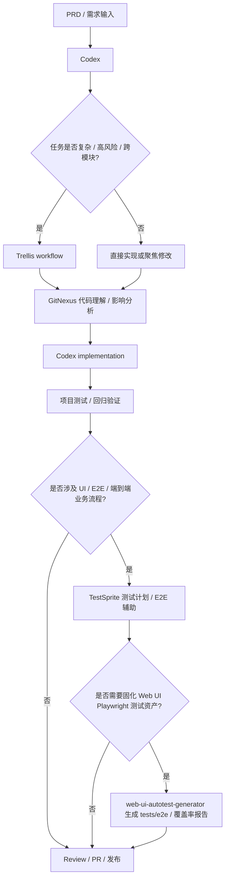

# AI Tools 项目工具流程精简概要

> 本文件记录个人 Codex Agent Harness 的模板化工具定位、版本监控基线和 Skill 编排规则。
> 当前主流程已收敛为 `Codex + GitNexus + Trellis + TestSprite`。
> `web-ui-autotest-generator` 作为 Web UI Playwright 测试资产生成的可选专项分支，不替代 TestSprite。
> `React Bits Pro Skill` 仅作为 React / shadcn UI 项目的可选前端组件与 blocks 集成辅助，必须先确认技术栈、项目内 Skill 安装状态和可读取的 license key。
> 本仓库当前可复用模板和本地安装 / 重置自动化集中在 `kuno-workflow-onboard-skills/`，旧 `agents/` 和 `skills/` 顶层目录已移除。

## 0. 版本监控配置

> 自动化任务优先读取本章节。后续如需新增指定工具，在下表继续追加即可。

| 工具 | GitHub 仓库 | 当前使用版本 | 版本通道策略 | 是否启用监控 | 备注 |
|---|---|---:|---|---|---|
| Codex | openai/codex | v0.140.0 | stable-only | 是 | 核心 Coding Agent |
| Trellis | mindfold-ai/trellis | v0.6.2 | stable-only | 是 | 复杂任务编排 / TDD workflow |
| GitNexus | abhigyanpatwari/GitNexus | v1.6.7 | stable-only | 是 | 代码理解、依赖关系、影响分析 |
| TestSprite | 待明确 | latest | manual | 否 | 测试计划、E2E、自动化测试辅助 |
| web-ui-autotest-generator | Cheryl-station/web-ui-autotest | main | manual | 否 | Web UI Playwright 测试资产生成 Skill |
| React Bits Pro Skill | pro.reactbits.dev | manual | manual | 否 | React / shadcn UI 组件与 blocks 集成辅助 |
| 待添加 | owner/repo | 未明确 | stable-only | 否 | 后续需要监控的新工具在此补充 |

---

## 0.1 本仓库模板源路径

当前源路径以 `kuno-workflow-onboard-skills/` 为唯一承载目录：

| 内容 | 当前源路径 | 用途 |
|---|---|---|
| Codex 全局规则模板 | `kuno-workflow-onboard-skills/templates/agents/AGENTS.global.md` | `同步` / `sync` 时写入 `/Users/lusonglin/.codex/AGENTS.md`，也可由 onboard Skill 安装 |
| 项目级规则模板 | `kuno-workflow-onboard-skills/templates/agents/AGENTS.project.md` | 由具体项目手动落地，或通过 onboard Skill 在确认项目根目录后安装 |
| 全局 Skill 模板 | `kuno-workflow-onboard-skills/templates/skills/*/SKILL.md` | `同步` / `sync` 时写入 `/Users/lusonglin/.agent/skills/<skill>/SKILL.md`，目标路径保持不变 |
| Onboard Skill | `kuno-workflow-onboard-skills/` | 初始化或重置本地 Codex 全局 AGENTS、项目 AGENTS 和 Kuno workflow skills |

每日版本检查自动化评估规则影响时，应扫描根 `AGENTS.md` 和 `kuno-workflow-onboard-skills/` 下的 Skill 入口、参考文档、安装脚本与 bundled templates；不要再扫描已删除的旧 `agents/` 或 `skills/` 顶层目录。

---

## 1. 当前核心 Agent Harness Workflow

### 1.1 主流程



### 1.2 工具定位

| 工具 | 当前定位 | 是否进入主流程 | 使用边界 |
|---|---|---:|---|
| Codex | 主 coding agent | 是 | 默认执行代码理解、修改、调试、测试、文档生成等任务 |
| GitNexus | 代码理解 / 影响分析 / debug / refactor 辅助 | 是 | 代码结构、影响范围、Bug 根因或重构风险不清时调用 |
| Trellis | 复杂任务编排 / 多阶段任务 / TDD workflow | 按场景启用 | 中大型任务、高风险任务、跨模块任务、长期任务启用；小任务不强制使用 |
| TestSprite | 测试计划 / E2E / 自动化测试辅助 | 测试阶段启用 | 涉及 UI/E2E、端到端业务流程、测试计划生成或回归验证，且 TestSprite MCP 已配置、配置门户可完成时启用 |
| web-ui-autotest-generator | Web UI Playwright 测试资产生成 / 覆盖率审计 | 按需启用 | 需要把 Web UI/E2E 回归用例固化到项目仓库时启用；不替代项目已有测试体系 |
| React Bits Pro Skill | React Bits Pro 组件 / blocks / landing page section 集成辅助 | 按需启用 | 仅在前端 UI 开发、项目为 React 技术栈（如 Next.js、Vite React、Remix、TanStack Start React、TanStack Router React 应用）+ shadcn/ui，且项目环境已安装对应 React Bits Pro Skill 并能读取 `REACTBITS_LICENSE_KEY` 时启用 |

---

## 2. mattpocock/skills 接入规则

仅接入外部评估表格中“是否建议接入”为“是”的官方 Skill，并默认原样使用官方文件。mattpocock/skills 1.0 后，旧名 `diagnose`、`write-a-skill` 已迁移，`zoom-out` 已从官方仓库移除；本配置只保留 1.0+ canonical Skill：

```text
diagnosing-bugs
tdd
grill-me
grill-with-docs
grilling
domain-modeling
codebase-design
handoff
writing-great-skills
to-prd
to-issues
```

### 2.1 使用边界

| Skill | 使用场景 | 本地适配 |
|---|---|---|
| `diagnosing-bugs` | bug、测试失败、运行时错误、性能回归、线上问题、日志异常、数据不一致 | 结合 GitNexus debugging / impact-analysis；修复后补充回归测试 |
| `tdd` | bug 修复、核心业务逻辑、算法行为、数据转换、导入 / 导出 / 同步逻辑、高风险修改 | 依赖 `codebase-design`；不强制用于简单文案、样式、配置说明或一次性脚本 |
| `grill-me` | 通用需求澄清、方案质询、计划压力测试 | 依赖 `grilling`；一次问一个关键问题；能通过读项目文件回答时先读文件 |
| `grill-with-docs` | 项目内需求澄清、术语对齐、CONTEXT.md / ADR 沉淀 | 依赖 `grilling` 和 `domain-modeling`；不把 CONTEXT.md 写成临时规格书 |
| `grilling` | 可复用逐问题访谈循环 | 作为 `grill-me` / `grill-with-docs` 的底层依赖，不作为默认独立入口 |
| `domain-modeling` | 项目语言、glossary、CONTEXT.md / ADR 建模辅助 | 遵守本地 `docs/CONTEXT.md`、`docs/adr/*.md` 路径约束 |
| `codebase-design` | 模块、接口、seam、adapter 和测试面设计 | 作为 `tdd`、陌生模块理解和结构性修改前的设计辅助 |
| `handoff` | 长会话切换、`/clear`、新会话、Trellis 暂停或多会话交接 | 输出目标、已完成工作、决策、文件、命令、开放问题、下一步和脱敏说明 |
| `writing-great-skills` | 创建或维护自定义 Skill 的质量规则 | `SKILL.md` 做入口；长内容拆 reference；确定性操作优先脚本化 |
| `to-prd` | 将当前对话和代码库理解整理为 PRD | 默认输出 Markdown PRD；不自动发布到 issue tracker |
| `to-issues` | 将 PRD、plan 或 spec 拆成实现任务 | 默认输出 Trellis-ready Markdown vertical slices；不自动发布到 issue tracker |

### 2.2 推荐编排

小型代码修改：

```text
Codex
  → 修改
  → 项目测试
```

普通 Bug 修复：

```text
diagnosing-bugs
  → GitNexus debugging（根因不清时）
  → Codex fix
  → tdd / codebase-design（需要回归测试或测试面设计时）
  → 项目测试
```

线上问题 / 客户反馈 / 日志异常：

```text
diagnosing-bugs
  → 时间线 / 事实 / 假设 / 排除项
  → GitNexus debugging（涉及代码根因时）
  → Codex fix or mitigation
  → tdd regression test
  → TestSprite（涉及 UI/E2E 且 MCP / 配置门户可用时）
  → web-ui-autotest-generator（需要固化 Web UI Playwright 用例时）
```

中大型功能开发：

```text
grill-me / grill-with-docs（内部使用 grilling，涉及项目语言时使用 domain-modeling）
  → to-prd
  → to-issues as Trellis-ready Markdown tasks
  → Trellis workflow（默认 native）
  → GitNexus impact-analysis
  → Codex implementation
  → tdd / codebase-design（行为风险需要回归测试或测试面设计时）
  → project tests / TestSprite（MCP / 配置门户可用时）
  → web-ui-autotest-generator（需要固化 Web UI Playwright 用例时）
  → React Bits Pro Skill（React / shadcn UI、项目内 Skill 与 license key 前提都满足时）
```

高风险后端逻辑 / 算法 / 权限 / 计费 / 状态机 / 数据同步：

```text
grill-with-docs
  → domain-modeling
  → to-prd
  → to-issues as Trellis-ready Markdown tasks
  → Trellis TDD workflow
  → tdd / codebase-design
  → GitNexus impact-analysis
  → Codex implementation
  → regression tests
```

陌生模块理解 / 修改前理解上下文：

```text
代码阅读 / codebase-design
  → GitNexus exploring
  → GitNexus impact-analysis
  → Codex implementation
```

长任务切换 / 上下文压缩：

```text
handoff
  → new session / Codex / Trellis continuation
```

---

## 3. Trellis 当前使用要点

| 项目 | 当前结论 |
|---|---|
| 当前关注版本 | v0.6.2 |
| 当前定位 | 复杂任务编排 / 多阶段任务 / TDD workflow |
| 启用条件 | 存在 Trellis 强证据，或任务复杂度需要 Trellis |
| Native Workflow | 普通功能开发、文档修改、小型 bug 修复、工具配置调整 |
| TDD Workflow | 后端算法逻辑、数据处理逻辑、高风险改动、回归敏感模块 |
| Channel | 仅用户明确要求多 Agent、多模型、worker、forum、thread、并行评审或外部 orchestrator 时启用 |

---

## 4. GitNexus 当前使用要点

| 项目 | 当前结论 |
|---|---|
| 当前定位 | 代码结构理解、影响分析、调试辅助、重构辅助 |
| 使用方式 | 优先使用全局 gitnexus-mcp |
| Skills 处理 | `gitnexus_impact_analysis` 和 `gitnexus_detect_changes` 不再作为自定义 Skills 维护 |
| 常见命令 | `gitnexus analyze --force`、`gitnexus analyze --embeddings` |
| 使用条件 | GitNexus MCP 可用，且当前项目已建立索引 |
| 不可用时 | 跳过 GitNexus，不阻塞任务 |

---

## 5. TestSprite 当前使用要点

| 项目 | 当前结论 |
|---|---|
| 当前定位 | 测试计划、E2E、自动化测试辅助 |
| 后端框架 | 已查询 Laravel / PHP 支持情况 |
| 移动端 | 已查询 Android / iOS / Flutter 支持情况 |
| Windows 端 | 已查询 Windows 自动化测试支持情况 |
| 本地生成目录 | `testsprite_tests/` |
| 建议入库文件 | 末尾为 `test_plan.json` 和 `_prd.json` 的文件倾向保留 |
| 不建议入库文件 | `TC` 开头的具体测试用例文件倾向不 push，除非团队后续明确需要固化 |
| 官方配置边界 | `testsprite_bootstrap_tests` 会打开 Testing Configuration / Configuration Portal；当前模板不要描述为可后台跳过 |
| Codex 可代办 | 准备 PRD 草稿、定位 `projectPath` / `localPort` / `type` / `testScope`、整理测试需求和 `additionalInstruction`，并在配置完成后继续编排 MCP 工具 |
| 需要门户确认 | 测试类型 / 范围、应用 URL、测试账号或认证方式、PRD 上传等按 TestSprite 配置页面完成 |
| 凭据安全 | 不把真实账号、密钥、PII 或生产数据写入仓库、PRD、测试代码或报告；需要凭据时走配置门户、环境变量或团队 secret 流程 |

---

## 6. web-ui-autotest-generator 当前使用要点

| 项目 | 当前结论 |
|---|---|
| 当前定位 | Web UI Playwright 测试资产生成、选择器审计和覆盖率报告 |
| 上游仓库 | `Cheryl-station/web-ui-autotest` |
| 启用条件 | 用户明确要求生成 Web UI 自动化测试、Playwright / E2E suite，或需要把关键 Web UI 回归路径固化到项目仓库 |
| 默认产物 | `tests/e2e/`、`playwright.config.ts`、`ui-test-manifest.json`、`ui-selector-audit.json`、`ui-test-coverage.json`、中文测试报告 |
| 与 TestSprite 关系 | TestSprite 继续负责测试计划、E2E 和回归验证辅助；本 Skill 只在需要 repo-resident Playwright 测试资产时补充 |
| 使用原则 | 优先沿用项目已有 Playwright / Cypress 体系；脚本扫描结果必须复核；不要自动写入真实账号、密钥或生产数据 |
| 提交策略 | 测试代码和必要配置可按项目策略入库；HTML report、trace、video、screenshot、一次性 repair plan 默认不入库 |
| 同步策略 | 当前不进入本仓库 `同步` 目标；只有实际安装为全局 Skill 后再另行纳入同步范围 |

---

## 7. React Bits Pro Skill 当前使用要点

| 项目 | 当前结论 |
|---|---|
| 当前定位 | React / shadcn UI 项目的 React Bits Pro 组件、blocks 和 landing page section 集成辅助 |
| 官方配置入口 | `https://pro.reactbits.dev/docs/skills`、`https://pro.reactbits.dev/docs/installation` |
| Skill 安装方式 | 在项目根目录运行 `npx shadcn@latest add @reactbits-starter/skill`，将 React Bits Pro `SKILL.md` 安装到当前项目；这是项目级安装，不是全局安装 |
| 技术栈前提 | React 项目，包括 Next.js、Vite React、Remix、TanStack Start React、使用 TanStack Router 的 React 应用等；已初始化 shadcn/ui；Node.js 18+；项目根目录存在 `components.json` |
| Registry 前提 | `components.json` 中存在 React Bits Pro registries：`@reactbits-starter` 用于 components，`@reactbits-pro` 用于 Pro / Ultimate blocks |
| 凭据前提 | 执行 `shadcn` 或 Agent 的当前环境必须能读取到 `REACTBITS_LICENSE_KEY` 的值；Agent 不打印、不输出、不提交 license key |
| Skill 可用性前提 | 项目中已存在由官方 shadcn registry 安装的 React Bits Pro `SKILL.md`；如果其他前提都满足但项目未安装该 Skill，先在项目根目录执行安装命令，安装成功且 key 可读后才使用 |
| 启用条件 | 前端 UI 开发任务需要接入 React Bits Pro components / blocks / templates，且技术栈、registry、项目内 Skill、可读取 license key 条件同时满足 |
| 跳过条件 | 非 React 前端、TanStack 的 Vue / Solid / Svelte 等非 React adapter、未使用 shadcn/ui、项目内 Skill 未安装且无法安装或安装失败、无法读取 `REACTBITS_LICENSE_KEY`、缺少 registry、普通业务逻辑修改、纯后端 / 测试 / 文档任务 |
| 使用原则 | 优先读项目内已安装的 React Bits Pro Skill；沿用项目组件路径、别名、Tailwind / CSS 变体和设计系统；不把 React Bits Pro 作为默认 UI 方案强推 |
| 同步策略 | 当前不把 React Bits Pro Skill 纳入本仓库 `同步` 目标；其 `SKILL.md` 属于授权内容，应由具体项目自行安装 |

---

## 8. 当前版本汇总

| 类别 | 工具 | 当前版本记录 |
|---|---|---:|
| Coding Agent | Codex | v0.140.0 |
| Agent Harness | Trellis | v0.6.2 |
| 代码理解 | GitNexus | v1.6.7 |
| 自动化测试 | TestSprite | latest |
| Web UI 测试资产 | web-ui-autotest-generator | main |
| 前端 UI 组件辅助 | React Bits Pro Skill | manual |

---

## 9. 精简结论

当前 AI Tools 的主线调整为：

```text
Codex 作为核心开发入口
GitNexus 负责当前代码理解和影响分析
Trellis 负责复杂任务编排和 TDD workflow
TestSprite 负责测试计划、E2E 和回归验证
web-ui-autotest-generator 仅在需要固化 Web UI Playwright 测试资产时启用
React Bits Pro Skill 仅在 React / shadcn UI、项目内 Skill 已安装且 license key 可读取时辅助接入组件和 blocks
```

辅助策略：

```text
mattpocock/skills = official skills unchanged + AGENTS usage boundaries
```
