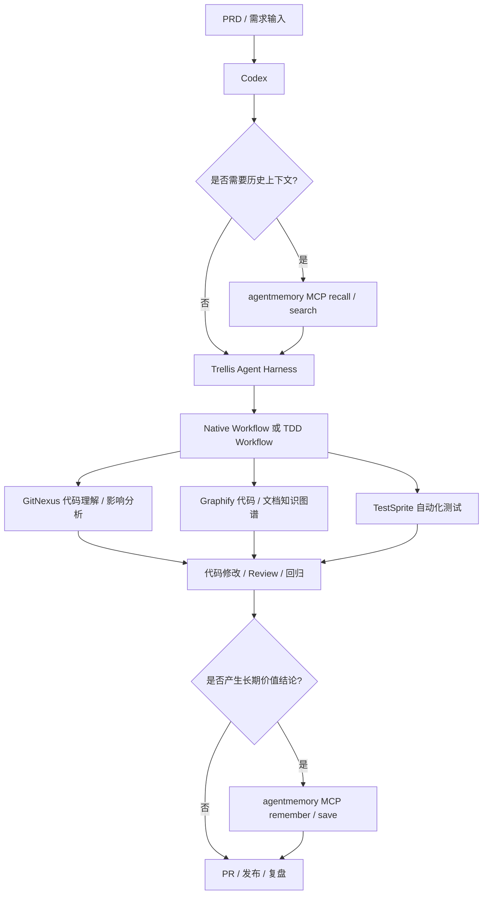

# AI Tools 项目工具流程精简概要

> 基于当前 AI Tools 项目下已查询、讨论和实际使用过的内容整理。  
> 本版本在原有 Codex + Trellis + GitNexus + Graphify + TestSprite 主流程基础上，补充并融入 `agentmemory` 的 MCP-only 接入模式。  
> 版本信息仅记录当前上下文中明确出现过的版本；未明确出现的版本不做推断。

## 0. 版本监控配置

> 自动化任务优先读取本章节。后续如需新增指定工具，在下表继续追加即可。

| 工具 | GitHub 仓库 | 当前使用版本 | 版本通道策略 | 是否启用监控 | 备注 |
|---|---|---:|---|---|---|
| Codex | openai/codex | v0.132.0 | stable-only | 是 | 核心 Coding Agent |
| Trellis | mindfold-ai/trellis | v0.6.0-beta.20 | same-prerelease-channel | 是 | Agent Harness / 工作流编排 |
| GitNexus | abhigyanpatwari/GitNexus | V1.6.5 | stable-only | 是 | 代码理解、依赖关系、影响分析 |
| Graphify | safishamsi/graphify | v0.8.14 | stable-only | 是 | 仓库知识图谱生成 |
| agentmemory | rohitg00/agentmemory | v0.9.21 | stable-only | 是 | AI 编程代理持久化记忆；当前推荐 MCP-only 接入 Codex |
| 待添加 | owner/repo | 未明确 | stable-only | 否 | 后续需要监控的新工具在此补充 |

---

## 1. 当前核心 Agent Harness Workflow

### 1.1 融合 agentmemory MCP-only 后的主流程



### 1.2 流程定位

agentmemory 在当前流程中不是新的 Agent Harness，也不是 Trellis / GitNexus / Graphify / TestSprite 的替代品，而是 Codex 的长期上下文记忆层。

| 环节 | 原流程 | 融合 agentmemory 后 |
|---|---|---|
| 任务开始 | Codex 读取 PRD、AGENTS.md、Skills | Codex 先判断是否需要从 agentmemory MCP 检索历史上下文 |
| 任务编排 | Trellis 选择 Native Workflow 或 TDD Workflow | Trellis 仍负责 workflow；agentmemory 只提供历史记忆 |
| 代码理解 | GitNexus / Graphify 辅助分析 | GitNexus / Graphify 仍以当前工作项目为准；agentmemory 只补充历史决策和踩坑记录 |
| 测试验证 | TestSprite 辅助生成测试计划与回归 | TestSprite 仍负责测试；重要测试策略可沉淀进 agentmemory |
| 任务结束 | Review / PR / 发布 / 复盘 | 若产生长期价值，Codex 调用 agentmemory MCP 写入结构化记忆 |

### 1.3 MCP-only 模式下的关键原则

```text
agentmemory 不会自动接管 Codex。
Codex 需要在用户提示词或 AGENTS.md 规则驱动下，主动调用 agentmemory MCP 工具。
```

MCP-only 模式下的调用边界：

| 项目 | MCP-only 模式 |
|---|---|
| MCP 工具 | 可用 |
| `$recall`、`$remember` 等 skills | 通常不依赖 |
| 生命周期 hooks | 不依赖 |
| 自动记录所有会话 | 不作为默认能力 |
| 推荐使用方式 | 通过提示词或 AGENTS.md 明确要求 Codex 主动 recall / remember |

---

## 2. 当前主流程工具

| 工具 | 当前定位 | 当前使用/讨论版本 | 使用状态 | 备注 |
|---|---|---:|---|---|
| Codex | 核心 Coding Agent | v0.132.0 | 已纳入主流程 | 作为主要开发执行入口，配合 AGENTS.md、Skills、Trellis、GitNexus、Graphify、agentmemory 使用 |
| Trellis | Agent Harness / 工作流编排 | v0.6.0-beta.20 | 已纳入主流程 | 重点关注 Native Workflow 与 TDD Workflow 的切换 |
| agentmemory | 持久化记忆 / 历史上下文检索 | v0.9.21 | 已纳入主流程 | 当前推荐 Codex MCP-only 接入；用于 recall 历史上下文与 remember 长期价值结论 |
| GitNexus | 代码理解、依赖关系、影响分析 | V1.6.5 | 已纳入主流程 | 使用全局 gitnexus-mcp；不再作为自定义 Skill 维护 |
| Graphify | 仓库知识图谱生成 | v0.8.14 | 已纳入/持续评估 | 当前关注 `graphify extract .`、`graphify update .`、LLM API Key 配置、全仓库/多仓库建图能力 |
| TestSprite | AI Testing Agent / 自动化测试 | latest | 使用中 | 当前认为比 Midscene 更成熟好用；支持前后端测试场景，需要评估生成文件是否入库 |

---

## 3. 当前推荐开发流程

### 3.1 需求到开发

1. 编写 PRD。
2. 将 PRD 提供给 Codex。
3. Codex 读取 AGENTS.md 与项目 Skills。
4. Codex 判断是否需要调用 agentmemory MCP：
   - 如果涉及历史项目决策、架构约定、历史故障、跨会话任务，则先 recall / search。
   - 如果是简单一次性任务，可跳过 agentmemory。
5. Codex 根据 agentmemory 返回的历史上下文进行初步归纳。
6. Trellis 根据任务选择 Native Workflow 或 TDD Workflow。
7. 使用 GitNexus 辅助理解代码结构、变更影响、依赖关系。
8. 使用 Graphify 生成或更新仓库知识图谱。
9. Codex 执行代码修改。
10. TestSprite 生成测试计划、测试用例并辅助回归。
11. 进行 Review、提交 PR、发布。
12. 如果本次任务产生长期价值结论，Codex 调用 agentmemory MCP 写入结构化记忆。

### 3.2 agentmemory recall 适用场景

| 场景 | 是否建议 recall | 说明 |
|---|---:|---|
| 跨会话持续开发任务 | 是 | 需要找回之前的设计决策、上下文和未完成事项 |
| 涉及项目架构或业务规则 | 是 | 可检索历史约定，但当前事实仍需以当前工作项目文件为准 |
| 涉及 Trellis workflow 调整 | 是 | 可检索之前对 Native / TDD workflow 的使用约定 |
| 涉及 Graphify / GitNexus 使用策略 | 是 | 可检索历史工具配置、踩坑和推荐命令 |
| 线上故障 / 性能问题复盘 | 是 | 可检索类似历史故障、定位方式和修复结论 |
| 简单文案修改 | 否 | 通常无须引入历史记忆 |
| 小范围临时 bug 修复 | 视情况 | 若与历史问题相关则 recall，否则可跳过 |

### 3.3 agentmemory remember 适用场景

| 场景 | 是否建议 remember | 说明 |
|---|---:|---|
| 重要架构决策 | 是 | 例如模块边界、目录规范、技术选型 |
| 关键 bug 根因和修复方式 | 是 | 尤其是线上故障、复杂排障、性能问题 |
| GitNexus 影响分析结论 | 是 | 记录影响面、依赖模块、回归范围 |
| Graphify 建图或更新结论 | 是 | 记录建图范围、限制、LLM API Key 需求、语义抽取结果 |
| TestSprite 测试策略 | 是 | 记录哪些文件入库、哪些测试用例不入库、回归重点 |
| 临时实验过程 | 视情况 | 只有重要踩坑或后续会复用时才记录 |
| API Key / 密码 / token | 否 | 禁止写入 agentmemory |

### 3.4 Native Workflow 适用场景

| 场景 | 说明 |
|---|---|
| 普通功能开发 | 需求明确、风险中等、无需先写测试 |
| 文档修改 | PRD、README、AGENTS.md、Skill 文档调整 |
| 小型 Bug 修复 | 问题范围明确，可直接定位和修复 |
| 工具配置调整 | Trellis / GitNexus / Graphify / TestSprite / agentmemory 等配置变更 |

### 3.5 TDD Workflow 适用场景

| 场景 | 说明 |
|---|---|
| 后端算法逻辑 | 规则复杂、边界条件多、需要测试先行 |
| 数据处理逻辑 | MongoDB、Meilisearch、日志分析、处方笺识别数据分析 |
| 高风险改动 | 影响范围大，需要先固化预期行为 |
| 回归敏感模块 | 历史上容易引入问题的核心流程 |

---

## 4. agentmemory 当前使用要点

| 项目 | 当前结论 |
|---|---|
| 当前关注版本 | v0.9.21 |
| 当前定位 | Codex 的长期项目记忆层 / 跨会话历史上下文层 |
| 推荐接入方式 | 优先使用 MCP-only 接入 Codex |
| 核心用途 | recall 历史上下文；remember 长期价值结论 |
| 不替代的工具 | 不替代 Trellis、GitNexus、Graphify、TestSprite |
| 是否默认用于所有任务 | 否；复杂任务、跨会话任务、历史项目任务优先使用 |
| 当前事实来源 | 当前工作项目文件、GitNexus、Graphify、测试结果优先；agentmemory 仅作历史上下文 |
| 禁止记录 | API Key、密码、token、敏感凭据、无长期价值的临时信息 |

### 4.1 Codex MCP-only 接入后的调用流程

```text
用户需求
→ Codex 读取 AGENTS.md
→ Codex 判断是否需要历史上下文
→ 需要时调用 agentmemory MCP recall / search
→ Codex 总结召回内容
→ Trellis 选择 Native Workflow 或 TDD Workflow
→ GitNexus / Graphify / TestSprite 辅助执行
→ Codex 完成代码修改、文档更新或分析
→ 有长期价值时调用 agentmemory MCP remember / save
→ PR / 发布 / 复盘
```

### 4.2 推荐的 Codex 主动调用提示词

#### 任务开始前 recall

```text
请先调用 agentmemory MCP，检索当前工作项目相关的历史记忆，重点查找：
1. Trellis workflow 使用约定
2. Graphify / GitNexus 的使用规则
3. 当前工作项目的架构决策
4. 之前类似问题的处理记录

拿到记忆后，先总结可用上下文，再开始分析本次需求。
```

#### 任务完成后 remember

```text
请调用 agentmemory MCP，将本次任务的关键结论写入长期记忆，内容包括：
1. 项目名称
2. 任务背景
3. 涉及模块 / 文件
4. 关键技术决策
5. 验证结果
6. 后续注意事项

不要记录 API Key、密码、token 或其他敏感凭据。
```

#### recall + 执行 + remember 组合模板

```text
请按以下流程处理本任务：

1. 先调用 agentmemory MCP，检索当前工作项目相关记忆：
   - Trellis workflow
   - Graphify 使用约定
   - GitNexus 使用约定
   - 当前工作项目架构决策
   - 历史类似问题

2. 根据检索到的记忆，结合当前工作项目文件进行分析。
   注意：agentmemory 只作为历史上下文，当前事实必须以当前工作项目文件为准。

3. 执行必要的代码阅读、修改、测试或文档更新。

4. 任务完成后，如产生长期价值结论，调用 agentmemory MCP 写入本次关键结论：
   - 需求背景
   - 处理方案
   - 修改文件
   - 测试结果
   - 后续风险
```

### 4.3 AGENTS.md 同步策略

本仓库只是 Codex 配置文件与 Skill 的摘录/同步源，不代表真实业务项目结构。为减少 Codex 上下文噪音，agentmemory MCP-only 规则按层级拆分维护：

- 全局规则：`agents/AGENTS.global.md` 与实际全局 `AGENTS.md` 只保存通用可用性判断、recall / remember 边界、事实源优先级和敏感信息禁令。
- 配置仓库规则：根目录 `AGENTS.md` 只保存本配置摘录仓库自身规则、每日版本检查、`更新` / `update` 指令和对 `ENTRYPOINT.md` 的引用。
- 项目规则模板：`agents/AGENTS.project.md` 用于同步到真实项目仓库根目录的 `AGENTS.md`，补充项目级 Trellis、GitNexus、Graphify、Channel、验证和 Lessons 规则，并继承全局 agentmemory 边界。
- Skill 规则：Skill 只保留自身生命周期、验证或记录职责；agentmemory 这类跨工具调度规则不重复写入每个 Skill。
- 本地实际路径同步：只有用户主动输入 `同步` 或 `sync` 时，才同步 `agents/AGENTS.global.md` 和 4 个全局 Skill 到本地 PC；普通编辑任务不自动同步。

不要把本章节或提示词模板整段复制进多个 AGENTS.md。需要调整规则时，优先按上面的职责边界更新对应文件。

---

## 5. Graphify 当前使用要点

| 项目 | 当前结论 |
|---|---|
| 当前关注版本 | v0.8.14 |
| 建图命令 | 优先使用 `graphify extract .` |
| 更新命令 | 使用 `graphify update .` 更新已有图谱 |
| 旧命令差异 | 旧版本中曾出现 `graphify .` 用法；新版本应以当前 CLI help 为准 |
| LLM API Key | 文档、图片、完整语义抽取需要配置 LLM API Key |
| 可用 API Key 类型 | GEMINI_API_KEY / GOOGLE_API_KEY / MOONSHOT_API_KEY / ANTHROPIC_API_KEY / OPENAI_API_KEY |
| 大仓库处理 | 超过阈值时需要缩小范围或分目录执行 |
| 当前关注问题 | 多仓库关联建图、全仓库代码级图谱、文档/图片语义抽取 |
| 与 agentmemory 的关系 | Graphify 负责当前工作项目知识图谱；agentmemory 可记录建图结论、限制和后续注意事项 |

---

## 6. GitNexus 当前使用要点

| 项目 | 当前结论 |
|---|---|
| 当前定位 | 代码结构理解、影响分析、调试辅助、重构辅助 |
| 使用方式 | 优先使用全局 gitnexus-mcp |
| Skills 处理 | `gitnexus_impact_analysis` 和 `gitnexus_detect_changes` 不再作为自定义 Skills 维护 |
| 常见命令 | `gitnexus analyze --force`、`gitnexus analyze --embeddings` |
| 当前关注点 | 是否需要重复执行 analyze、embeddings 的必要性、limit=1000 的含义 |
| 与 agentmemory 的关系 | GitNexus 负责当前代码分析；agentmemory 可记录重要影响分析结论和历史踩坑 |

---

## 7. TestSprite 当前使用要点

| 项目 | 当前结论 |
|---|---|
| 当前定位 | 更偏向采用的 AI Testing Agent |
| 后端框架 | 已查询 Laravel / PHP 支持情况 |
| 移动端 | 已查询 Android / iOS / Flutter 支持情况 |
| Windows 端 | 已查询 Windows 自动化测试支持情况 |
| 本地生成目录 | `testsprite_tests/` |
| 建议入库文件 | 末尾为 `test_plan.json` 和 `_prd.json` 的文件倾向保留 |
| 不建议入库文件 | `TC` 开头的具体测试用例文件倾向不 push，除非团队后续明确需要固化 |
| 与 agentmemory 的关系 | TestSprite 负责当前测试计划和执行；agentmemory 可记录测试策略、回归范围和入库规则 |

---

## 8. 当前工具组合建议

### 8.1 主开发组合

```text
Codex
  + agentmemory MCP-only
  + Trellis
  + GitNexus
  + Graphify
  + TestSprite
```

适合当前主要目标：

- 需求拆解
- 历史上下文召回
- 代码理解
- AI 辅助开发
- 自动化测试
- 回归验证
- PRD / 技术任务拆解
- 代码知识图谱沉淀
- 关键项目决策和踩坑记录沉淀

### 8.2 推荐执行顺序

```text
PRD 输入
→ Codex 读取 AGENTS.md
→ Codex 判断是否需要 agentmemory MCP recall
→ 如需要，调用 agentmemory MCP 检索历史上下文
→ Trellis 选择 Workflow
→ GitNexus 分析影响面
→ Graphify 提供仓库知识图谱
→ Codex 实现
→ TestSprite 生成测试计划与回归验证
→ Review / PR / 发布
→ 如产生长期价值结论，调用 agentmemory MCP remember
```

### 8.3 工具职责边界

| 工具 | 负责什么 | 不负责什么 |
|---|---|---|
| Codex | 主开发执行、分析、修改、总结 | 不应单独替代测试和影响分析 |
| agentmemory | 历史上下文 recall、长期价值结论 remember | 不作为当前代码事实源，不替代 GitNexus / Graphify |
| Trellis | Workflow 编排、任务拆解、Native / TDD 流程选择 | 不作为长期记忆层 |
| GitNexus | 当前代码理解、依赖关系、影响分析、调试辅助 | 不负责跨会话记忆 |
| Graphify | 当前工作项目知识图谱、代码 / 文档语义结构 | 不负责记录任务过程和历史决策 |
| TestSprite | 自动化测试计划、测试用例、回归辅助 | 不负责架构决策记忆 |

---

## 9. 当前版本汇总

| 类别 | 工具 | 当前版本记录 |
|---|---|---:|
| Coding Agent | Codex | v0.132.0 |
| Agent Harness | Trellis | v0.6.0-beta.20 |
| 持久化记忆 | agentmemory | v0.9.21 |
| 代码理解 | GitNexus | V1.6.5 |
| 知识图谱 | Graphify | v0.8.14 |
| 自动化测试 | TestSprite | latest |

---

## 10. 精简结论

当前 AI Tools 项目的主线调整为：

```text
Codex 作为核心开发入口
agentmemory MCP-only 作为 Codex 的长期历史上下文层
Trellis 作为 Agent Harness 编排层
GitNexus 负责当前代码理解和影响分析
Graphify 负责当前工作项目知识图谱
TestSprite 负责自动化测试与回归验证
```

agentmemory 的推荐定位：

```text
复杂任务、跨会话任务、历史项目任务：先 recall。
普通简单任务：可跳过。
产生长期价值的架构决策、问题根因、工具配置、测试策略：完成后 remember。
当前事实始终以当前工作项目文件、GitNexus、Graphify、测试结果为准。
```
