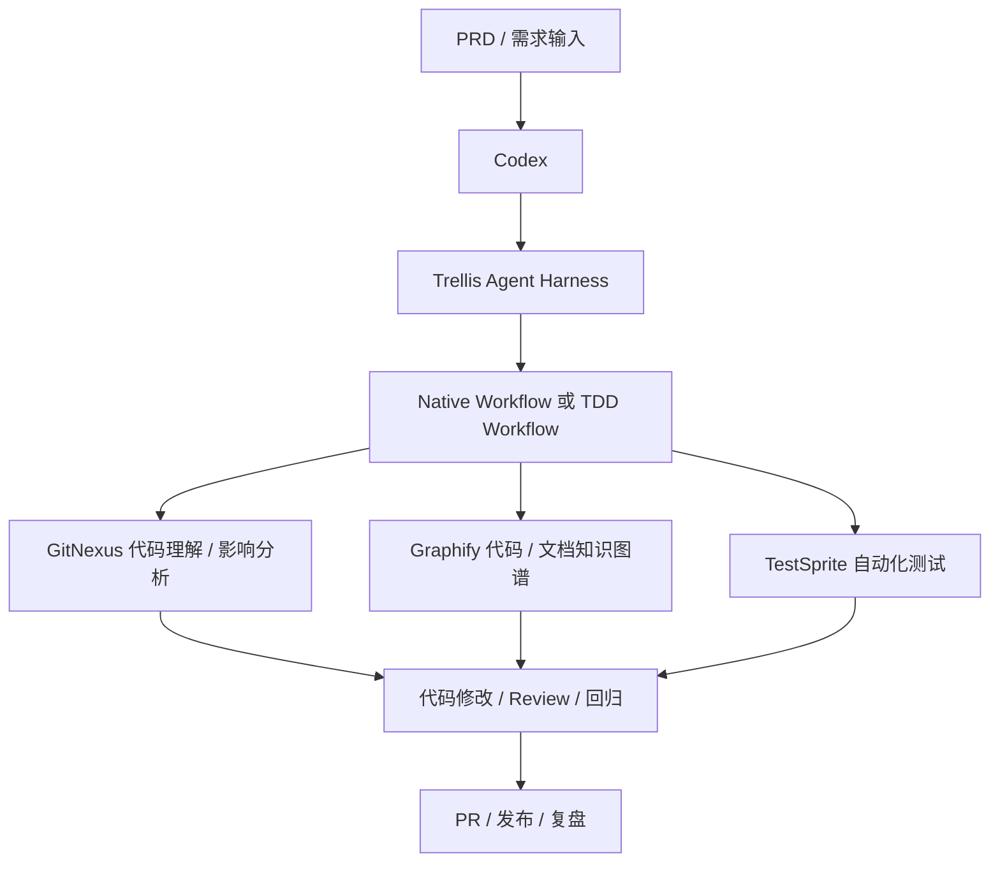

# AI Tools 项目工具流程精简概要

> 基于当前 AI Tools 项目下已查询、讨论和实际使用过的内容整理。  
> 版本信息仅记录当前上下文中明确出现过的版本；未明确出现的版本不做推断。

## 0. 版本监控配置

> 自动化任务优先读取本章节。后续如需新增指定工具，在下表继续追加即可。

| 工具 | GitHub 仓库 | 当前使用版本 | 版本通道策略 | 是否启用监控 | 备注 |
|---|---|---:|---|---|---|
| Codex | openai/codex | v0.131.0 | stable-only | 是 | 核心 Coding Agent |
| Trellis | mindfold-ai/trellis | v0.6.0-beta.18 | same-prerelease-channel | 是 | Agent Harness / 工作流编排 |
| GitNexus | abhigyanpatwari/GitNexus | V1.6.5 | stable-only | 是 | 代码理解、依赖关系、影响分析 |
| Graphify | safishamsi/graphify | v0.8.13 | stable-only | 是 | 仓库知识图谱生成 |
| 待添加 | owner/repo | 未明确 | stable-only | 否 | 后续需要监控的新工具在此补充 |

## 1. 当前核心 Agent Harness Workflow



## 2. 当前主流程工具

| 工具 | 当前定位 | 当前使用/讨论版本 | 使用状态 | 备注 |
|---|---|---:|---|---|
| Codex | 核心 Coding Agent | 未明确 | 已纳入主流程 | 作为主要开发执行入口，配合 AGENTS.md、Skills、Trellis、GitNexus、Graphify 使用 |
| Trellis | Agent Harness / 工作流编排 | beta 最新版本（具体号未明确） | 已纳入主流程 | 重点关注 Native Workflow 与 TDD Workflow 的切换 |
| GitNexus | 代码理解、依赖关系、影响分析 | 未明确 | 已纳入主流程 | 使用全局 gitnexus-mcp；不再作为自定义 Skill 维护 |
| Graphify | 仓库知识图谱生成 | v0.8.13；曾对比 v0.8.1、v0.8.10、v0.7.13、v0.7.10 | 已纳入/持续评估 | 当前关注 `graphify extract .`、`graphify update .`、LLM API Key 配置、全仓库/多仓库建图能力 |
| TestSprite | AI Testing Agent / 自动化测试 | 未明确 | 倾向采用 | 当前认为比 Midscene 更成熟好用；支持前后端测试场景，需要评估生成文件是否入库 |

## 3. 当前推荐开发流程

### 3.1 需求到开发

1. 编写 PRD。
2. 将 PRD 提供给 Codex。
3. Codex 读取 AGENTS.md 与项目 Skills。
4. Trellis 根据任务选择 Native Workflow 或 TDD Workflow。
5. 使用 GitNexus 辅助理解代码结构、变更影响、依赖关系。
6. 使用 Graphify 生成或更新仓库知识图谱。
7. Codex 执行代码修改。
8. TestSprite 生成测试计划、测试用例并辅助回归。
9. 进行 Review、提交 PR、发布。

### 3.2 Native Workflow 适用场景

| 场景 | 说明 |
|---|---|
| 普通功能开发 | 需求明确、风险中等、无需先写测试 |
| 文档修改 | PRD、README、AGENTS.md、Skill 文档调整 |
| 小型 Bug 修复 | 问题范围明确，可直接定位和修复 |
| 工具配置调整 | Trellis / GitNexus / Graphify / TestSprite 等配置变更 |

### 3.3 TDD Workflow 适用场景

| 场景 | 说明 |
|---|---|
| 后端算法逻辑 | 规则复杂、边界条件多、需要测试先行 |
| 数据处理逻辑 | MongoDB、Meilisearch、日志分析、处方笺识别数据分析 |
| 高风险改动 | 影响范围大，需要先固化预期行为 |
| 回归敏感模块 | 历史上容易引入问题的核心流程 |

## 4. Graphify 当前使用要点

| 项目 | 当前结论 |
|---|---|
| 当前关注版本 | v0.8.13 |
| 建图命令 | 优先使用 `graphify extract .` |
| 更新命令 | 使用 `graphify update .` 更新已有图谱 |
| 旧命令差异 | 旧版本中曾出现 `graphify .` 用法；新版本应以当前 CLI help 为准 |
| LLM API Key | 文档、图片、完整语义抽取需要配置 LLM API Key |
| 可用 API Key 类型 | GEMINI_API_KEY / GOOGLE_API_KEY / MOONSHOT_API_KEY / ANTHROPIC_API_KEY / OPENAI_API_KEY |
| 大仓库处理 | 超过阈值时需要缩小范围或分目录执行 |
| 当前关注问题 | 多仓库关联建图、全仓库代码级图谱、文档/图片语义抽取 |

## 5. GitNexus 当前使用要点

| 项目 | 当前结论 |
|---|---|
| 当前定位 | 代码结构理解、影响分析、调试辅助、重构辅助 |
| 使用方式 | 优先使用全局 gitnexus-mcp |
| Skills 处理 | `gitnexus_impact_analysis` 和 `gitnexus_detect_changes` 不再作为自定义 Skills 维护 |
| 常见命令 | `gitnexus analyze --force`、`gitnexus analyze --embeddings` |
| 当前关注点 | 是否需要重复执行 analyze、embeddings 的必要性、limit=1000 的含义 |

## 6. TestSprite 当前使用要点

| 项目 | 当前结论 |
|---|---|
| 当前定位 | 更偏向采用的 AI Testing Agent |
| 后端框架 | 已查询 Laravel / PHP 支持情况 |
| 移动端 | 已查询 Android / iOS / Flutter 支持情况 |
| Windows 端 | 已查询 Windows 自动化测试支持情况 |
| 本地生成目录 | `testsprite_tests/` |
| 建议入库文件 | 末尾为 `test_plan.json` 和 `_prd.json` 的文件倾向保留 |
| 不建议入库文件 | `TC` 开头的具体测试用例文件倾向不 push，除非团队后续明确需要固化 |

## 7. Midscene 当前使用要点

| 项目 | 当前结论 |
|---|---|
| 当前定位 | UI 自动化测试备选 |
| 当前问题 | OpenAI API Key 模型验证失败 |
| 报错内容 | `js_default(...) is not a constructor` |
| 当前判断 | 稳定性和成熟度弱于 TestSprite |
| Codex 订阅关系 | 不能直接等同于可供 Midscene 调用的 API Key；通常仍需独立 API Key 配置 |

## 8. 其他 AI 平台与生成工具

| 工具 | 当前定位 | 当前版本 | 使用状态 | 备注 |
|---|---|---:|---|---|
| Replit | AI-powered platform | 未明确 | 已调研 | 用于快速开发、托管、原型验证 |
| liblib.tv | 图像/视频/音频生成平台 | 未明确 | 当前更偏向 | 更偏向其视频编排工作流 |
| muapi | 多媒体 API 平台 | 未明确 | 已调研 | 关注 API 化生成能力 |
| Runway | 视频生成平台 | 未明确 | 已调研 | 作为视频生成/编辑平台备选 |
| HyperFrames | HeyGen 视频制作框架 | 未明确 | 已调研 | 关注 Codex 配合其制作视频、文生视频/图生视频/视频修改能力 |
| MemPalace | Agent Memory / 上下文记忆增强 | 未明确 | 正在评估 | 关注是否需要纳入个人 agent harness workflow |

## 9. 运维与发布相关工具

| 工具 | 当前定位 | 当前使用/讨论版本 | 状态 | 备注 |
|---|---|---:|---|---|
| Semaphore UI | 自动化发布平台 | 当前使用 v2.16.51；已讨论最新 v2.18.2 | 已使用 | 已评估从 v2.16.51 升级到 v2.18.2 的注意事项 |
| Grafana | 监控平台 | 未明确 | 已使用/评估 | 已查询版本更新评估 |
| cAdvisor | 容器指标采集 | 曾尝试 v0.56.1 | 已使用/排障 | 遇到 `gcr.io/cadvisor/cadvisor:v0.56.1` manifest not found |
| Zellij | 终端会话管理 | 未明确 | 已使用 | 关注后台会话、layout、zellij web、Tailscale 远程访问 |
| Tailscale | 远程访问组网 | 未明确 | 已使用/评估 | 与 Zellij 搭配实现移动端远程连接 Mac 终端 |

## 10. 当前工具组合建议

### 10.1 主开发组合

```text
Codex
  + Trellis
  + GitNexus
  + Graphify
  + TestSprite
```

适合当前主要目标：  
- 需求拆解  
- 代码理解  
- AI 辅助开发  
- 自动化测试  
- 回归验证  
- PRD / 技术任务拆解  
- 代码知识图谱沉淀  

### 10.2 推荐执行顺序

```text
PRD 输入
→ Codex 读取 AGENTS.md
→ Trellis 选择 Workflow
→ GitNexus 分析影响面
→ Graphify 提供仓库知识图谱
→ Codex 实现
→ TestSprite 生成测试计划与回归验证
→ Review / PR / 发布
```

## 11. 当前版本汇总

| 类别 | 工具 | 当前版本记录 |
|---|---|---:|
| Coding Agent | Codex | v0.131.0 |
| Agent Harness | Trellis | v0.6.0-beta.18 |
| 代码理解 | GitNexus | V1.6.5 |
| 知识图谱 | Graphify | v0.8.13 |
| 自动化测试 | TestSprite | 未明确 |
| 自动化测试 | Midscene | 未明确 |
| 发布平台 | Semaphore UI | v2.18.2 |
| 监控 | Grafana | v12.4.3 |
| 容器监控 | cAdvisor | v0.56.2 |
| 终端会话 | Zellij | v0.44.2 |
| 远程组网 | Tailscale | V1.98.2 |
| Remote Coding Tool | Paseo | v0.1.78 |
| 视频制作框架       | HyperFrames  |         latest |

## 12. 精简结论

当前 AI Tools 项目的主线是：

```text
Codex 作为核心开发入口
Trellis 作为 Agent Harness 编排层
GitNexus 负责代码理解和影响分析
Graphify 负责仓库知识图谱
TestSprite 负责自动化测试与回归验证
```
