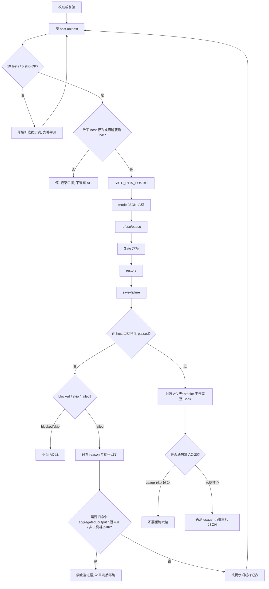

# Codex / OMP 三模式 host smoke 验证手册

本文件是 **P1-15 及后续同类 host 会话** 的操作说明。执行器是 `tests/test_p1_15_host_mode_smoke.py`；口径以该文件为准。任务设计见 `docs/prd/sbtd-workflow-v2-host-mode-smoke.md`。

本仓库是配置摘录源，不是业务项目。本手册不生成 `.feature`，不代替 P2 逐项目 smoke，也不把一次本机 live 当成发布通过。

## 证明什么、不能证明什么

| 层 | 证明什么 | 不能证明什么 |
|---|---|---|
| 无 host unittest | 解析规则、提示词、夹具、两 host 齐格逻辑 | Agent 是否按模式执行 |
| TaskRouter unittest | 拒绝保存、推荐暂停的机器选择 | 真实会话是否先暂停 |
| 入口文件字节 / 空白分词 | 文件规模观察 | AC-20 token |
| `codex exec` / `omp --print` | 隔离目录里的可观察回复与副作用 | CI 可复现、Windows host、完整 Book/BDD/Ponytail、P3 观察统计 |

六个 host×mode 必须是真实 CLI。mock、源码字符串匹配、TaskRouter 返回值 **不能** 冒充 Agent 已按模式执行。

## 何时再跑

需要再跑的情况：

- 改了 AGENTS / `sbtd-task` / 三模式路由 / 保存恢复 / Gate 分层判定
- P2-04 独立部署后的逐项目 smoke 需要对照本口径
- P3 观察后复验 host 行为
- 解析规则（读事件、mode 散文、persist 信号）变更后

不必再跑的情况：

- **AC-20**：usage 已测过且远超 2k。再开六格不会变绿。要接近目标先瘦公共核心，再测一次。
- 只改本手册或设计笔记、不改测试 / 提示词 / 解析函数

P1-16、P2 迁移、P3 发布不因本手册自动开始。

## 前置

- 本机有 `codex`、`omp`，且已登录。只复制真实 `~/.codex/auth.json` 到隔离 HOME，不写真实 HOME。
- 不设 `SBTD_P115_HOST` 时，live 五测全部 skip。CI 默认跳过。
- 报告型命令 **不要** 用 `rtk`（会缓存 / 跳过文件副作用）。`rtk`: `skipped-for-report`。
- 单格 `subprocess` 超时 180 秒。Gate 六格大约 3–4 分钟；restore + save 合计大约 3–4 分钟。不要中途杀进程。
- 不 sync live automation，不创建 rc tag。

## 状态词

| 状态 | 含义 | 可否当 AC 绿 |
|---|---|---|
| `passed` | 该格规则通过 | 仅当该 AC 要求的 **两 host 全格** 都 passed |
| `blocked` | CLI 缺失、未登录、无读事件 | **否**。记原因，不伪造通过 |
| `failed` | 有会话但口径不满足 | **否**。先看 `reason`，不要先改产品 |
| unittest `skip` | 两 host 未齐、或未 opt-in | **否**。skip 不是发布通过 |
| unittest `FAIL` | `assertFalse(failed)` 命中 | 先看 `_cell_public`：`host/mode/status/reason/observed` |

断言失败时只应看压缩字段。**不要**把 `stdout` 里的 `command_execution` 当助手回复。

## 命令

在仓库根执行。环境变量写在命令字符串里。

无 host（每次改解析 / 提示词后先跑）：

```bash
python -B -m unittest tests.test_p1_15_host_mode_smoke
```

预期：19 tests / 5 skip / OK（未设 `SBTD_P115_HOST`）。

Live 按依赖顺序，不必一次全开。改了哪层验哪层。

```bash
# 1. mode JSON 六格（AC-04 smoke）
SBTD_P115_HOST=1 python -B -m unittest -v \
  tests.test_p1_15_host_mode_smoke.HostModeSmokeTests.test_live_host_mode_matrix

# 2. 拒绝保存 / 暂停（AC-22 host 半边）
SBTD_P115_HOST=1 python -B -m unittest -v \
  tests.test_p1_15_host_mode_smoke.HostModeSmokeTests.test_live_host_refuse_pause

# 3. Gate 分层六格（AC-14/23 smoke）
SBTD_P115_HOST=1 python -B -m unittest -v \
  tests.test_p1_15_host_mode_smoke.HostModeSmokeTests.test_live_host_gate_layering

# 4. 跨会话 restore（AC-24 一半）
SBTD_P115_HOST=1 python -B -m unittest -v \
  tests.test_p1_15_host_mode_smoke.HostModeSmokeTests.test_live_host_cross_session

# 5. 保存失败（AC-24 另一半；与 4 合起来才是 AC-24）
SBTD_P115_HOST=1 python -B -m unittest -v \
  tests.test_p1_15_host_mode_smoke.HostModeSmokeTests.test_live_host_save_failure
```

Isolation 由测试自己建临时 `HOME` / `USERPROFILE` / `CODEX_HOME` / `PI_CODING_AGENT_DIR`。不要手工改用户 HOME。



## 隔离与 CLI

- 只断言临时项目树，不 `rglob` 真实 `~/.codex`。
- 只复制 `auth.json`。Graft 走隔离 `HOME/.codex`，与 `CODEX_HOME` 同指。
- OMP：`--print --no-session --no-extensions --tools read`。`--no-extensions` **不**关 Skill；`--no-skills` 才关。需要 `sbtd-task` 时显式 `--skills sbtd-task`。
- Codex：`exec --ephemeral --sandbox read-only --skip-git-repo-check --json`。保存失败格改 `workspace-write`。
- OMP 保存失败格：`--tools read,write`。
- **仅 Gate** 给 OMP 加 `--mode json`。restore / save 用文本回复抽 mode。

### 夹具

| 格 | 模式来源 | 不写 |
|---|---|---|
| mode JSON / refuse / Gate | 根目录 `MODE` | `task.md` |
| restore / save | `task.md` + `.sbtd/active-task.json` | `MODE` |

路径：default → `.sbtd/tasks/<id>/task.md`；lite/strict → `ai/tasks/<id>/task.md`。过期 handoff 放 `docs/handoffs/`。

Gate / 跨会话提示 **不**点名 default/lite/strict，也 **不**点名 `book_gate_plan` / `loaded_strict_ref` / `strict.md`。SAVE 可以说用户确认切到 strict，但必须再要求：

`State the current execution mode and whether the save persisted.`

RESTORE 必须要求说出 current execution mode。检测只认 `Current execution mode: **lite**` / `current mode is \`lite\`` 这类散文，**不认** “session mode”。

## 判定规则（本次踩过的坑）

### 1. 读事件

分两层，不要写成「JSON 里的 `path` / `command` 一律不算」。

**有没有读（`_has_tool_trace`）**  
记录必须是工具 **kind / name**，才算有读：

- kind：`command_execution`、`file_read`、`tool_call`、`function_call`、`mcp_tool_call`、`tool`、`tool_use`
- name：`read`、`bash`、`grep`、`glob`

非工具记录上的裸 `path` / `command` **不算**有读。否则 OMP 会假绿。

无 tool-trace → `blocked` / `no-read-trace`，**不是** default/lite 的 AC-23 通过。

**有没有打开 `strict.md`（`_strict_ref_loaded`）**  
先确认该记录是工具 item，再在它的 `command` / `path` / `file` / `arguments` / `input` 里找 `references/strict.md`。工具上的 path **要算**。


### 2. 登录失败

只看 **stderr** 里的明确句子和 `401` / `403`。不要扫 stdout JSON 里的 token 或模型说的 `authentication details`。假 auth 会把已登录的 default 格打成 blocked，整项 skip。

### 3. 助手回复 vs 命令输出

- 事件 JSONL（`item.completed` / `agent_message` 等）：**只**看助手 `agent_message` 文本。
- 普通 JSON 对象（如 `{"session_mode":"strict"}`）不是事件流，仍走 JSON 抽取。
- **禁止**扫 `command_execution` 的 `aggregated_output`。restore 的 task.md 是 lite、handoff 是 strict，混扫会假绿或假红。

### 4. Gate 分层

| mode | 要通过 | 失败 |
|---|---|---|
| default / lite | 有读事件，且 **未**读 `references/strict.md`、未输出 Gate 表 | `unexpected-strict-gate` |
| strict | 有读事件，且读了 `strict.md` **或** 助手输出含 `\| Gate \|` 与 `book-refactoring-pass` | `missing-strict-gate` |

这是分层 smoke，**不是**完整 Book / BDD / Ponytail 执行。

### 5. restore（跨会话）

磁盘任务是 lite，过期 handoff 写 strict。助手必须报 **lite**。报 strict → `handoff-override`。抽不到 mode → `missing-lite-mode`。

### 6. save-failure

只读目录导致写不进去。必须同时：

- 磁盘 `task.md` 字节未变（仍是 default）
- 助手报会话 **strict**（不是 default）
- 助手带未持久化信号

未持久化标记（小写后包含即可）：

- `not persisted` / `unpersisted` / `could not save` / `cannot save`
- `permission denied` / `read-only`
- `save persisted: **no**` / `save persisted: no`
- `未持久化` / `无法保存` / `保存失败`

live 出现过 `Save persisted: **No**`。当时表里没有这句 → `missing-unpersisted-signal`，尽管 `observed=strict`。补标记必须先写单测覆盖该 live 字符串，**不要**从命令 stdout 发明新词。

`Save persisted: **Yes**` 不得当失败信号。

## AC 口径

| AC | 怎样算过 | 本手册提醒 |
|---|---|---|
| AC-04 | 六格隔离会话能读 MODE 并回 JSON；两 host 全 passed | 只是会话 smoke，不是完整澄清 / 实现 / Gate |
| AC-14 | Gate 六格两 host passed | 分层 smoke，不是完整 Book/BDD |
| AC-19 | 仓库 CI 可复现归 P1-14 | 本项 host **不进 CI** |
| AC-20 | 主机 JSON `usage`；公共核心约 2k、轻入口 ≤3k 是测量目标 | **量过未达标**：Codex mode 约 3.9 万、Gate 约 6.5–8.7 万 input tokens／格（含大量 cache）。OMP 无 usage。禁止字数换算冒充达标。再跑六格无意义 |
| AC-22 | TaskRouter unittest + live refuse JSON（`current=recommended` 的反例：current 保持 default、paused、keep_option） | split：机器层与 host 层分开记 |
| AC-23 | default/lite 有读且未开 strict；strict 有 `strict.md` 或 Gate 表 | 同 AC-14，不是弱流程全验收 |
| AC-24 | restore 两 host lite **且** save 两 host 会话 strict + 未持久化 + 磁盘未改 | 只跑 restore **不是** AC-24 |

任一层两 host 不齐 → skip 或 blocked，整项不能勾 done。

## 报告

- 正式 raw JSON + 同 stem 中文 Markdown + `.evidence.json` 写到 `tests/api/reports/`。
- 文件名含分支 slug 与时间戳。stem 示例：`api-report-p1-15-host-mode-smoke-p1-15-codex-omp-mode-smoke-YYYY_mm_dd-HH_MM_SS`。
- `evidenceSource=developer-local`，dirty 只能 `publication=local-only`。
- **不要**把这些报告 commit 进仓库（本机 exclude）。
- 报告里的 usage **不得**当成 AC-20 已达标。

## 修失败的顺序

1. 先跑无 host unittest，把 live 字符串做成夹具（助手回复，不要 tool stdout）。
2. 再跑失败的那一类 live，不要无故重跑六格。
3. 提示词与检测必须对齐：检测认 `current execution mode`，提示词就要这句话。
4. 不要追隔离环境的 `xcrun` / `/tmp` git 警告，除非 `returncode != 0` 或磁盘被改。
5. 不要把 skip、partial、measured-not-met 说成发布通过。

## 与后续任务

- P2-04 逐项目 smoke：可复用本口径（隔离、两 host、skip≠绿），但夹具是真实项目，不是本测试的临时树。
- P3 观察后再验：先看本手册的「不必再跑」，避免用六格假装 AC-20。
- 瘦核心是产品改动，做完再测 usage，仍只用主机 JSON。
