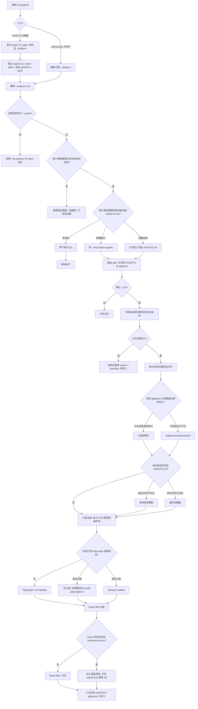

# --init-projects 只初始化项目

project-only 模式。与普通 `--projects-root` + `--action init|reset` 互斥。不检测、不安装、不更新、不配置任何全局 Agent CLI、runtime、Tools、Skills、全局 AGENTS 或 MCP。

`python scripts/onboard.py init-projects` 接受可选 `--platform`，但不需要 Trellis CLI、用户名或其平台标志。Trellis 参数已移除；普通项目无 task、developer 或 bootstrap 仍可检查和安装必要资产。

`install.sh --platform ... --init-projects` 仍跳过 Agent CLI gate，但会把 `--platform` 传给 `onboard.py`。

两安装器在可选 Playwright / React Bits 安装之前调用完整 `check-projects`，包含状态、目标和保护冲突；`--skip-project-agents` 仅排除用户未选择的 AGENTS 目标。Python 核心写入前再次检查所有所选根。下面展示核心写入流程，optional 安装仍各自确认。



## 从未初始化 vs 项目已有配置后再跑

| 对象 | 项目从未初始化 | 项目已有文件后再跑 |
|---|---|---|
| 全局任何东西 | 不检查、不安装 | 仍然不碰 |
| Agent `--platform` | 仅平台上下文，不调用或安装 Agent CLI | 同样无全局操作 |
| 项目 `AGENTS.md` | Q4 同意才复制 | Q4 同意则备份后覆盖 |
| `.gitignore` | 追加缺行 | 行齐全则 skip |
| task / developer / bootstrap | 不预建，缺失正常 | 只读检查选中记录；未完成 bootstrap 返回 6 |
| 旧 `.trellis` 或异常状态 | 无旧工具前置依赖 | 保留并报告需用户处理，不自动迁移或重建 |
| Playwright / React Bits | `onboard.py` 只在写入后汇报 | `install.sh` 才可能在写入前询问并另装 |

入口示例：

```bash
# 直接子命令：只维护必要项目安装资产
python scripts/onboard.py init-projects \
  --platform codex \
  --projects-root /abs/project-one \
  --yes

# 根安装器包装: 跳过 Agent CLI gate, 仍转发 --platform
bash install.sh --platform codex --init-projects /abs/project-one --yes
```
