# Onboard Skill 执行 init

普通 `init`，不是 `--init-projects`。目标 Agent 平台在 Skill 里是**单数**：只选 `codex` / `claude` / `kimi` / `oh-my-pi|omp` 之一。平台只决定 CLI 与 MCP adapter，不决定全局 AGENTS 落点。

`plan --json` 包含安装 operations、路径来源和只读 `sbtdInit` 检查；不执行 CLI 安装或创建可选状态。完整 v2 尚未发布，Graft／host／迁移仍按各自任务交付。

Required Question 4「要不要安装项目 `AGENTS.md`」必须单独确认。「逐项目汇总 AGENTS」只是汇报，不是同意写入。

初始 Agent version 查询可只读提前；所有安装、MCP 和可选项目写入均须等完整项目前置检查通过，Python 写入前再复验。

```mermaid
flowchart TD
  start[Agent 调用 sbtd-workflow-onboard 执行 init] --> q[解析 Required Questions]
  q --> plat{目标 Agent 平台是否已给出且为单数?}
  plat -->|否或给了多个| askPlat[停下来问唯一平台]
  plat -->|是| q4{用户是否明确同意安装项目 AGENTS.md?}
  q4 -->|未表态| askAgents[停下来问 Q4]
  q4 -->|明确跳过| skipProjAgents[带 --skip-project-agents]
  q4 -->|明确安装| wantProjAgents[计划写入项目 AGENTS.md]
  askPlat --> stopAsk[等待用户]
  askAgents --> stopAsk
  skipProjAgents --> earlyCheck
  wantProjAgents --> earlyCheck[完整只读 check-projects, 尊重 AGENTS 选择]
  earlyCheck --> earlySafe{所有所选项目允许安装?}
  earlySafe -->|否| earlyBlock[报告逐项目冲突, 不执行任何安装或配置写入]
  earlySafe -->|是| cliGate
  cliGate["check-agent-cli --platform 唯一平台"] --> cliOk{该平台 version 命令通过?}
  cliOk -->|是| skipCli[already-installed: 不重装]
  cliOk -->|否| npmForCli{npm 可用?}
  npmForCli -->|否| ensureNpm[ensure-npm 后再装 Agent CLI]
  npmForCli -->|是| installCli[按平台安装官方全局包并复验]
  skipCli --> preflight
  ensureNpm --> installCli
  installCli --> preflight[check: 本地工具与 Skills]
  preflight --> graftOk{固定 Graft CLI 已验证可用?}
  graftOk -->|是| plan
  graftOk -->|否| graftConsent{展示安装计划后明确同意?}
  graftConsent -->|否| skipGraft[记录不可用, 不安装或升级 npm]
  skipGraft --> plan
  graftConsent -->|是| installGraft[Python install-graft --yes]
  installGraft --> graftReady{包/native/telemetry 验证通过?}
  graftReady -->|否| blockTools[报告实际失败阶段, 不循环安装]
  graftReady -->|是| plan[输出 plan --json 后需用户确认]
  plan --> confirm{确认执行 init --yes?}
  confirm -->|否| abort[不写文件]
  confirm -->|是| stateCheck[Python 检查所有所选项目状态及安装目标]
  stateCheck --> stateOk{状态及目标允许写入?}
  stateOk -->|否| stateBlock[逐项目报告原因与下一步, Python 零安装写入]
  stateOk -->|是| provider{官方 Ponytail plugin 已启用?}
  provider -->|是| providerBlock["阻断: provider=conflict, 人工禁用或移除 plugin 后重跑"]
  provider -->|否或无法检测| identity{legacy Skill 身份冲突?}
  identity -->|是| failClosed[fail-closed: 不改任何目标]
  identity -->|否| extMiss{缺失或无效的 required external Skills?}
  extMiss -->|有| installExt[只安装缺失项, 不询问]
  extMiss -->|无| skipExt[已合法: 不重装]
  installExt --> writes[按 operations 写入]
  skipExt --> writes

  writes --> gAgents{全局 AGENTS 目标已存在?}
  gAgents -->|从未安装| copyGlobal[复制到解析后的 Codex 全局 AGENTS 路径]
  gAgents -->|已安装| bakGlobal[先备份再覆盖]
  copyGlobal --> bundled[bundled Skills]
  bakGlobal --> bundled
  bundled --> bExist{bundled Skill 壳合法?}
  bExist -->|缺失或身份无效| copyBundled[复制到本次解析的全局 Skills 根]
  bExist -->|已合法| skipBundled[跳过, 不覆盖]
  copyBundled --> gitignore[项目 gitignore]
  skipBundled --> gitignore

  gitignore --> gi{项目 gitignore 已含模板全部非空行?}
  gi -->|从未安装或有缺行| appendGi[只追加缺行]
  gi -->|已安装且行齐全| skipGi[skipped-already-present]
  appendGi --> pAgents
  skipGi --> pAgents{本轮是否写入项目 AGENTS.md?}
  pAgents -->|否| done
  pAgents -->|是且文件不存在| copyProj[复制项目模板]
  pAgents -->|是且文件已存在| bakProj[备份后覆盖]
  copyProj --> done[复查并逐项目汇总 AGENTS / gitignore / SBTD]
  bakProj --> done
```

## 从未安装 vs 已安装后再 init

| 对象 | 从未安装 | 已安装后再 init |
|---|---|---|
| 唯一平台 Agent CLI | 校验失败才安装官方全局包 | version 通过则 `already-installed`，不升级 |
| npm / node | 仅缺失的已选 Agent 或明确接受的工具安装需要时处理 | 可用本地工具不因缺 npm 被重装 |
| Graft CLI | 展示固定包/native/telemetry计划，确认后调用Python安装 | 只读验证；不自动升级或接线 |
| rtk / caveman / Java / Maestro | 询问后才装 | 已验证则跳过 |
| 19 个 required external Skills | 安装缺失或身份无效项；官方 Ponytail plugin 启用时阻断 | 已合法则跳过 |
| 14 个 bundled Skills | 复制到解析后的全局 Skills 根 | 合法壳跳过；缺失或身份无效才复制 |
| 全局 `AGENTS.md` | 复制到 `$CODEX_HOME/AGENTS.md` 或 `~/.codex/AGENTS.md`；若 `~/.omp` 已存在，另备份后覆盖 `~/.omp/agent/AGENTS.md`（Windows 为 `%USERPROFILE%\.omp\agent\AGENTS.md`） | **备份后覆盖**；`~/.omp` 不存在则跳过且不创建 |
| 项目 `AGENTS.md` | 仅当 Q4 同意时复制 | 同意写入则备份后覆盖 |
| 项目 `.gitignore` | 追加模板缺行 | 行齐全则 skip |
| task / developer / spec / lessons / bootstrap | 不预建；无状态正常 | 只读检查选中状态，保留数据；旧 `.trellis` 请求显式迁移 |
| MCP | 交互配置；提示词没提则不要静默写 | 已有配置不自动改 |
| Playwright / React Bits | 仅项目适用时询问 | 仍是条件项，不是全量重装 |

`onboard.py init` 不代替 Agent/Graft 安装授权。Graft 使用独立 `install-graft`，不提前提供 graph/host/MCP 接线；project-only不进行全局安装。已有旧工具配置保留，不借本项清理。
